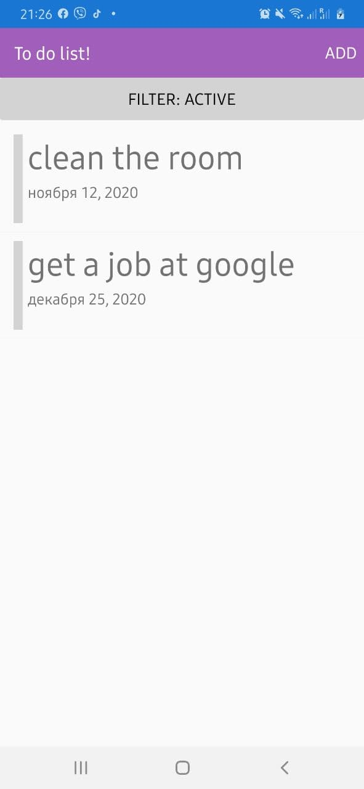
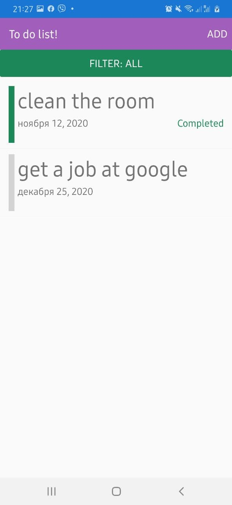
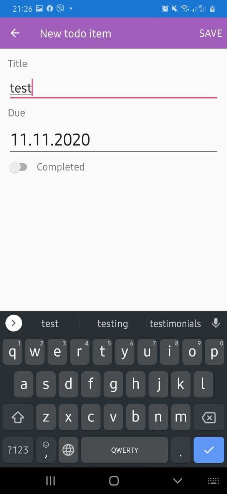

## Application with to do list
Task contains Title, Due date, Status(active, completed) 
* add new task by touch on menu item "add"
* edit existing list item by touch on it
* remove existing list item by holding on it

The application have filter that displays active or all tasks. 

List | Filter | Add new task
------------ | ------------- | -------------
||
